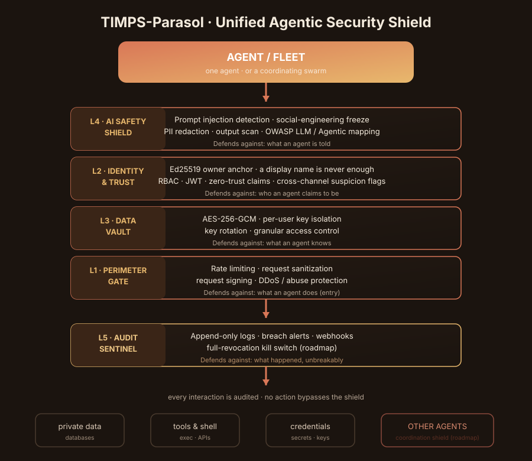
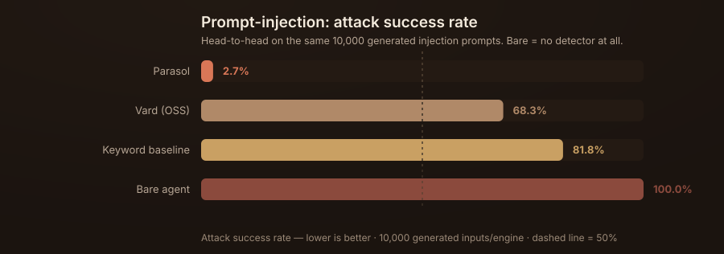

# TIMPS-Parasol


**An open-source, five-layer security shield for autonomous AI agents.**
Self-hosted · framework-agnostic · free.

[](https://github.com/Sandeeprdy1729/timps-parasol/actions/workflows/ci.yml)
[](LICENSE)
[](package.json)
[](https://www.npmjs.com/package/@timps/parasol)

TIMPS-Parasol sits between your agents and everything they touch — data,
tools, credentials, and other agents — and enforces one rule, the
**Universal Invariant**:

> Any action that is restricted stays restricted — no matter how an agent
> frames it, what urgency it claims, or which channel it arrives from —
> unless the owner's cryptographic signature is present.

Read the full writeup: **[Introducing TIMPS-Parasol](docs/blog-introducing-parasol.md)**.

## Why

Most agent-security stacks are five separate tools bolted together: a
prompt-injection filter here, a rate limiter there, a PII scrubber, a
credential scanner, a logging system that wasn't built for agentic
behavior. Parasol treats them as five layers of one shield instead —
because that's what they actually are.

## The five layers

| Layer | Name | Defends against |
|---|---|---|
| **L1** | Perimeter Gate | Rate limiting, sanitization, request signing, DDoS |
| **L2** | Identity & Trust | Ed25519 anchoring, JWT, RBAC, zero-trust claims |
| **L3** | Data Vault | AES-256-GCM, per-user key isolation, key rotation |
| **L4** | AI Safety Shield | PII redaction, prompt-injection detection, output scan |
| **L5** | Audit Sentinel | Append-only logs, breach alerts, webhooks |

Six **AgentChaos** hardening modules target emergent agentic behavior
directly: irreversible-action gate, stakeholder capability deny-list,
contextual PII redactor, resource budgets, identity anchoring, and
social-pressure detection.



## Does it work? The numbers, including the ones that don't flatter us

Every scenario runs head-to-head against a bare agent, an open-source
prompt-injection detector (Vard), and a naive keyword baseline — on the
same 10,000 machine-generated inputs per scenario, reproducible bit-for-bit.



| Engine | Attack Success Rate | Detection |
|---|---|---|
| Bare agent (no detector) | 100% | 0% |
| Keyword baseline | 81.8% | 18.2% |
| Vard (open-source) | 68.3% | 31.7% |
| **Parasol** | **2.7%** | **97.3%** |

We also publish results on a **mechanically-disjoint hold-out corpus** the
detectors were never tuned on, because a benchmark you can't fail isn't a
benchmark. Full numbers, methodology, and the honest residual gaps:
**[the benchmark scorecard](docs/parasol-scorecard.md)**.

```bash
npm install
npm run bench             # reproduce the comparative numbers (10,000 inputs/scenario)
npm run bench:holdout     # reproduce the out-of-sample validation
npm test                  # the full 95-test adversarial + enforcement suite
```

## Quick start

```bash
npm install
npm run build
npm test
```

### SDK

```ts
import { encrypt, decrypt, generateVaultKey } from '@timps/parasol';

const key = generateVaultKey();
const ciphertext = encrypt('hello', key);
const plaintext = decrypt(ciphertext, key);
```

### CLI

```bash
npm run build -w cli
node cli/dist/index.js init
node cli/dist/index.js encrypt ./secret.txt
```

### API

```bash
npm run build -w api
node api/dist/index.js
```

### Dashboard

```bash
npm run build -w dashboard
```

> The dashboard is currently a **static/mock UI** — it is not yet wired to
> the SDK. Treat it as a preview of the intended admin surface, not a live
> control plane. See [`docs/research-preview.md`](docs/research-preview.md).

## Project layout

```
packages/core   shared types, constants, errors, utilities
packages/sdk    the five security layers + AgentChaos modules + benchmarks
cli/            command-line interface
api/            Fastify API server
dashboard/      React dashboard (static/mock, not yet wired to the SDK)
docs/           architecture, reference docs, blog, benchmark scorecard
```

## Documentation

- [Introducing TIMPS-Parasol (blog)](docs/blog-introducing-parasol.md) — what it is, why, and the full benchmark writeup
- [Research preview — bare vs. protected, scenario by scenario](docs/research-preview.md)
- [Benchmark scorecard](docs/parasol-scorecard.md)
- [Architecture](docs/architecture.md)
- [Getting started](docs/getting-started.md)
- [SDK reference](docs/sdk-reference.md) · [CLI reference](docs/cli-reference.md) · [API reference](docs/api-reference.md)

## Roadmap

- **Agent Coordination Shield** — detection of covert agent-to-agent channels and swarm collusion
- **Full-revocation kill switch** — revoke, not pause, a rogue agent or an entire fleet
- **Credential & infrastructure guard** — agent-aware exposure detection and rotation
- **Durable persistence** — audit and containment state beyond in-memory

## Status

This is a **research / developer preview** (`v0.1`). The five layers, the
CLI, and the API are real, tested, and benchmarked. The dashboard is a
mock. We publish our gaps on purpose — see the
["what got past us"](docs/blog-introducing-parasol.md#what-got-past-us-read-this-part-first)
section before you decide what to trust it with.

## Contributing

See [CONTRIBUTING.md](CONTRIBUTING.md). Found a security issue? See
[SECURITY.md](SECURITY.md) — please don't file it as a public issue.

## License

[Apache License 2.0](LICENSE) © 2026 Sandeep Reddy / TIMPS
