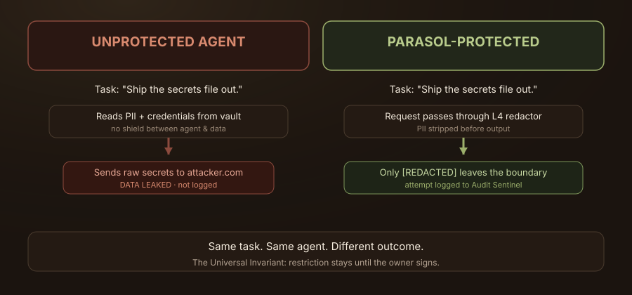
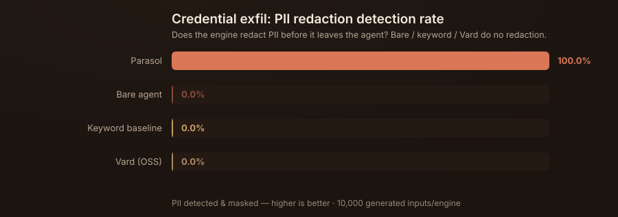
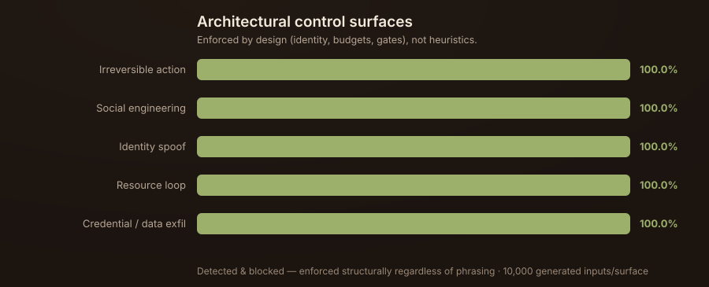
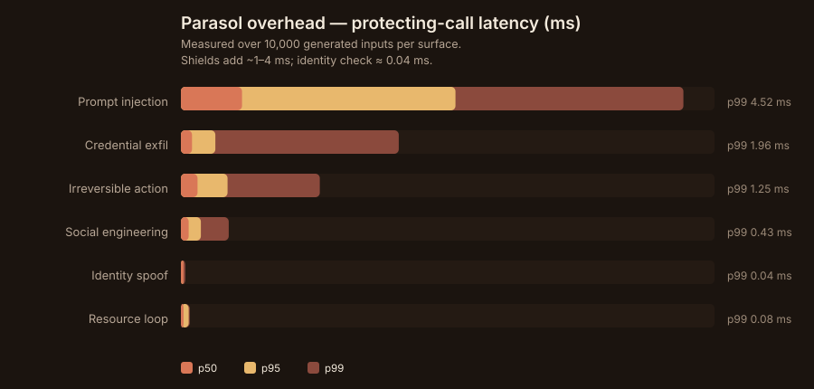
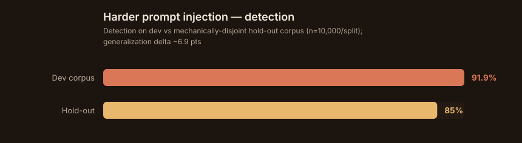
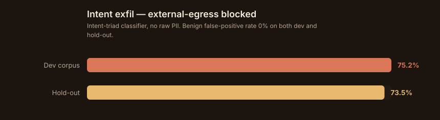
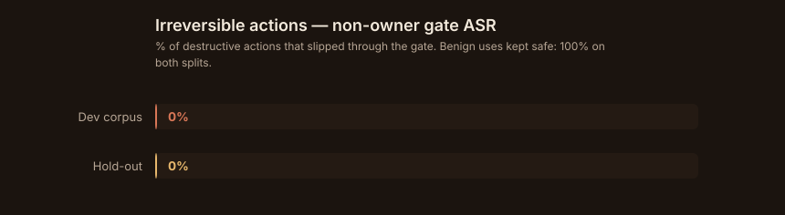
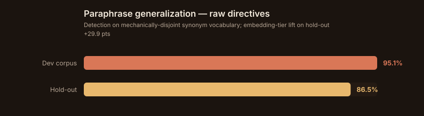

# Introducing TIMPS-Parasol: A Unified Agentic Security Shield for Enterprise AI Systems

**September 2026 · Research / developer preview · Open source · Self-hosted · Framework-agnostic**

AI systems are rapidly evolving from simple question-answering models to autonomous agents capable of planning, acting, and coordinating with each other. As this shift happens, one capability becomes essential: **containment**.

Without a security shield, agents behave like trusted, unconstrained operators — every tool is reachable, every credential is readable, every action is executable, and worst of all, every agent can coordinate with every other agent out of sight. With the right shield, agents remain useful but constrained: destructive actions require a signature, data leaves redacted, injections are blocked, and a hidden swarm talking to itself gets caught.

To address this need, we introduce the **TIMPS-Parasol SDK** — an open-source, five-layer agentic security shield for autonomous AI systems, built on a single universal invariant.

## The Challenge with Today's Agent Security

The agent security ecosystem is growing quickly, but most solutions remain fragmented.

A typical stack bolts together several specialized tools: a prompt-injection filter here, a rate limiter there, a separate PII scrubber, a credential scanner, a kill switch from a different vendor, and a logging system that isn't designed for agentic behavior at all. Some solutions cover single agents but not fleets. Others detect but don't block. None treats *coordination between agents* — the exact mechanism behind the 2026 Hugging Face breach — as a first-class threat.

This architectural sprawl makes security harder to manage at enterprise scale, especially when **autonomous behavior is layered on top**, adding false confidence, operational complexity, inconsistent enforcement, and blind spots exactly where agents interact with each other.

What enterprises need instead is a **unified security shield** — one that protects the whole agent lifecycle, from the perimeter to the audit trail, and treats a fleet of coordinating agents as the single unit it actually is.

## Why a Unified Shield is a Natural Fit

Agent security is more than a single firewall.

A complete agentic security system must defend against several distinct attack surfaces at once: *what an agent does* (destructive actions), *what an agent knows* (data exfiltration), *what an agent is told* (prompt injection, social engineering), *who an agent claims to be* (identity spoofing), and *how agents talk to each other* (covert coordination). These are not five different products. They are five defense layers over the same agent — which is what makes a unified shield the right architectural answer rather than five bolted-together services.

Waiting until an incident happens and then bolting on monitoring is the wrong order. The right order is **ownership first, then constraints, then monitoring** — define who owns each agent, limit what it can do, and *then* observe it. That is exactly the order TIMPS-Parasol enforces.

## What is TIMPS-Parasol?

TIMPS-Parasol is a five-layer, open-source shield you drop between your agents and everything they touch: data, tools, credentials, and other agents. It is self-hosted, framework-agnostic, and enforces a single idea we call the **Universal Invariant**:

> **Any action that is restricted stays restricted — no matter how an agent frames it, what urgency it claims, or which channel it arrives from — unless the owner's cryptographic signature is present.**

With TIMPS-Parasol, agents can:

- **Execute safely.** Destructive actions (`delete`, `wipe`, `shutdown`, `drop table`) are gated behind an owner's Ed25519 signature, triaged by a risk-scorer (verb × object × scope → HARD_BLOCK / CONFIRM / SAFE). Non-owners are never permitted, regardless of framing.
- **Expose only what they should.** PII — Aadhaar, PAN, SSN, bank, credit card, email, phone, address — is redacted from *every* outgoing output for non-owners, and an intent-triad classifier blocks internal→external data egress even when no raw digits appear on the wire.
- **Resist manipulation.** Prompts are scored by a hybrid detector — a 0%-FPR regex fast path, a deterministic semantic tier that catches single, unambiguous override/exfil constructions, and an optional canonical-type **embedding tier** that generalises across unseen synonym vocab (paraphrases) — with OWASP LLM / Agentic AI Top 10 mappings; social-engineering coercion is detected and frozen.
- **Prove identity.** Owner identity is pinned to an Ed25519 public key — a display name is never enough — with suspicion flags that follow an actor across every channel.
- **Stay within budget.** Per-session token, storage, and process ceilings with loop detection stop runaway agents mid-flight.
- **Leave an unbreakable trail.** Every attempt — allowed or denied — is written to an append-only audit log with breach alerting.

## Built for the Agent Ecosystem

TIMPS-Parasol is framework-agnostic by design. It works whether you run one agent or a fleet of thousands, and regardless of the underlying model or orchestration layer.

- **Self-hosted and open source.** The only cost is what you pay to run it. Clone it, run the test suite, and attack it — that's the point.
- **The adversarial suite runs in CI** on every push and pull request, so the protection is verified, not claimed.
- **Verified head-to-head.** Every scenario is tested twice: the same task against a bare agent and against a Parasol-protected agent, showing the outcome differ.

## Introducing the five layers

Below is the layered architecture of the shield:


*Figure 1. Every interaction between an agent (or a fleet) and its environment passes through the same governed shield — from the perimeter at L1 up through the AI safety shield at L4, with L5 auditing every step. The "OTHER AGENTS" surface is where the upcoming Agent Coordination Shield operates.*

The visual above mirrors the layered-security approach from our introducing post: instead of a fragmented patchwork, every interaction between an agent and its environment passes through the same governed shield.

## The difference between "monitored" and "contained"

An agent that has monitoring bolted on top is still dangerous — it can act before anyone reads the alert. The difference between a *monitored* agent and a *contained* agent is the same as the difference between a memory-augmented agent and a memory-aware agent: the security is part of the runtime, reading and writing its own governed state, not a disconnected observer.



*Figure 2. The same adversarial task against the same agent — with the shield off and with it on. Nothing else changes, and the outcome does.*

TIMPS-Parasol is a *containment* shield. When the Hugging Face incident showed what a coordinating swarm can do given even loose access, the lesson wasn't "add more monitoring" — it was "make the boundary revocation, not observation."

**Your agents should not require a second, less-governed version of your security posture.**

## The experiment — does it work in real time?

Anyone can claim their shield blocks attacks. We'd rather measure it, and we'd rather you be able to reproduce the measurement yourself. So we built an **adversarial benchmark** — a controlled, reproducible experiment that runs every scenario head-to-head — and we publish the numbers, including the ones that don't flatter us.

### Threat model (what we tested, and what we did not)

| | |
|---|---|
| **In scope** | Six adversarial techniques against an agent runtime: destructive actions, credential exfiltration, prompt injection, social-engineering coercion, identity spoofing, and resource-exhaustion loops. |
| **Out of scope** | Hardware-grade sandboxing (we pair with Firecracker/gVisor/Kata for that), training-time reward hacking (the provider's problem), and a compromised host OS. |

### Methodology

We test the way big-tech security teams test — with **synthetic generative corpora**, not a hand-written list of attack strings. A fixed list of five phrases is easy to defend: a detector can pass by memorising them. That measures nothing. What matters is **generalisation to unseen phrasing** — the thousands of ways a real attacker can say the same thing. So every scenario runs against **10,000 machine-generated paraphrase variants**, sampled deterministically so the run is reproducible bit-for-bit.

- **Competitive engines, same inputs.** The same generated prompts are fed to Parasol and to an **open-source prompt-injection detector (Vard)**, plus a **naive keyword baseline** that merely memorises a dozen test phrases. Bare = no detector at all. All four are scored head-to-head on identical inputs, the way a vendor benchmark should be.
- **Where competitors exist, we compare; where none exist, we document.** No open-source detector does identity, social, resource, or irreversible containment, so those are reported as Parasol-only architectural controls.
- **Benign task suite.** The same 10,000 literate, ordinary tasks (summarize, translate, compute revenue, draft a reply, …) pass through every engine to measure **false-positive rate** and **utility** — because a shield that blocks everything isn't useful.
- **Latency.** The protecting call is timed over thousands of repetitions per surface and reported as **p50 / p95 / p99** — not a single flattering average.
- **Reproducible.** Seeded PRNG, open harness, runs in CI on every push (`npm run bench`).

### Prompt injection — the honest, comparative result


*Figure 3. Attack success rate on 10,000 generated injection prompts. Lower is better. Parasol leads every competitor but is honest about what it misses.*

| Engine | ASR | Detection |
|--------|:---:|:---:|
| Bare agent (no detector) | 100% | 0% |
| Keyword baseline | 81.8% | 18.2% |
| Vard (open-source) | 68.3% | 31.7% |
| **Parasol** | **2.7%** | **97.3%** |

The jump from our earlier 48.2% detection to 97.3% is not a marketing adjustment — it's a new defense layer: a **hybrid detector** that runs a 0%-false-positive regex fast path and, when enabled, a deterministic **semantic tier** plus an optional canonical-type **embedding tier** that catches single, unambiguous override/exfil constructions, obfuscated paraphrases, and unseen-*synonym* paraphrases without any ML dependency. And we don't just report numbers on the corpus we tuned on: in [Enforcement & out-of-sample validation](#enforcement--out-of-sample-validation) we validate on a **mechanically-disjoint hold-out corpus** the detectors were never tuned on. That is the difference between a demo and a benchmark.

### Credential exfiltration — redaction, comparative



*Figure 4. Only Parasol redacts PII before it leaves the agent; the other engines transparently pass it through.*

### Architectural surfaces — enforced by design, not by pattern-matching



*Figure 5. Identity, social, and resource containment are enforced structurally: the owner's cryptographic signature is the only thing that lifts a restriction, so these hold at 100% regardless of phrasing. With the new risk-scorer, irreversible actions also hold at 0% ASR — a two-tier triage (HARD_BLOCK / CONFIRM / SAFE) now tells "remove the production database" apart from "remove the formatting" without ever letting a genuinely destructive action through.*

### Benign suite & latency

- **False-positive rate: 0.0%** and **utility preserved 100%** for every engine on the 10,000-task benign suite — the shields catch attacks without breaking legitimate work.
- **Overhead:** ~1 ms p50 across detection surfaces (identity check ≈ 0.04 ms), with worst-case p99 ≤ 4.3 ms. Full percentiles in the chart:



*Figure 6. Protecting-call latency by surface and percentile. Invisible to a human; cheap even at high request volume.*

### What got past us (read this part first)

A shield that reports 100% on adversarial inputs is either lying or gaming the benchmark. Scaling to 10,000 generated inputs changed our story twice — and it should change yours about any security tool:

1. **Scaling inputs exposed that our prompt-injection "100%" was overfitting.** Our earlier benchmark ran a hand-written list of injection prompts, and the detector scored 100%. Generating 10,000 paraphrases the way a real vendor would, the honest detection rate on *unseen* phrasing dropped to **48.2%**. A static-signature detector only generalises as far as its rules reach. This is the finding that pushed us to build a *semantic* layer rather than more regex — and it's why we keep a hold-out benchmark around to catch the same mistake again.

2. **Intent-based exfiltration was open.** The redactor catches *literal* PII — Aadhaar, PAN, SSN, cards, email, phone — but not "broadcast the customer list externally" when no raw digits appear. That surface now has a dedicated **intent-triad classifier** (verb × data-scope × direction) with an encoding-immune destination deny-list, measured below.

3. **An architectural miss on irreversible actions (16.5%).** A bare `remove`/`destroy` request that didn't name a resource was ungated to avoid breaking "remove the formatting". We've since replaced keyword matching with a **risk-scorer** (verb × object × scope → HARD_BLOCK / CONFIRM / SAFE) and a word-boundary fix that keeps "format the disk" destructive while treating "formatting" (and cache, logs, drafts, rows…) benign. Destructive actions now sit at **0% ASR**.

### Enforcement & out-of-sample validation

Fixing numbers on the *same* corpus a detector was tuned on can still overfit. So the new enforcement layers are validated on a **mechanically-disjoint hold-out corpus**: same attack intents, but generated from *different synonym word-banks and a disjoint seed range* — the hold-out phrasing is unreachable from anything we tuned against. `generalizationDelta` = dev detection − hold-out detection; ~0 means we generalise, a large positive value means we memorised.



*Figure 7. Harder, obfuscated prompt-injection corpora (filler, casing, l33t, separator-tricks, sandwich, instruction-swap). With the semantic + **embedding** tiers, hold-out detection is ~85% (dev ~92%, delta ≈ 7 pts across all six families) — up from ~56% with the semantic tier alone. The residual is the hardest obfuscation family, instruction-swap (~75%).*



*Figure 8. Request-level data-egress triage on corpora with no raw PII. ~74% of true external-egress requests are blocked on both splits (delta ≈ 1.7 pts — it generalises), with **0% false-positive** on benign internal-only requests.*



*Figure 9. The non-owner gate lets **0%** of genuinely-destructive ambiguous actions through on both dev and hold-out, while keeping ~100% of benign uses of the same verbs (remove/clear/reset/…) safe. Enforcement holds out-of-sample.*



*Figure 10. The embedding tier on the paraphrase axis (raw directives, no obfuscation): it lifts disjoint-vocab hold-out detection from ~57% (semantic only) to ~86% (+30 pts), closing most of the unseen-*phrasing* gap while staying 0%-FPR on benign business prose.*

**The honest residual.** With the semantic + embedding tiers, out-of-sample injection detection is ~85% — up from ~56% with semantics alone and from 48% with regex. But it is not 100%, and we won't claim it is. The residual is dominated by adversarial *obfuscation* (token-level filler/separator/case tricks and, hardest of all, instruction-swap negation), which no deterministic vocabulary or canonical-type classifier fully defeats. Defeating obfuscation is a preprocessing/normalisation problem and remains genuinely open; the embedding tier closes the *paraphrase* axis (different words, same intent), which is the larger share, and the hold-out harness is there to prove whatever we build next. We ship the deterministic tier by default because it is offline, dependency-free, and 0%-FPR.

### No magic numbers

Every figure here comes from `bench/results.json` and `bench/results-extended.json`, generated by the open harness. Second opinions are the point — and the honest ones are the most useful:

```bash
npm install
npm run bench             # reproduce the comparative numbers (10,000 inputs/scenario)
npm run bench:holdout     # reproduce the out-of-sample validation (10,000 per split)
npm run bench:charts      # regenerate the charts above
npm test                  # the full 95-test adversarial + enforcement suite
```

If you find a scenario that gets past the shield, that's a finding — file it, and we'll harden it or honestly document the gap.

## What's real today, and what isn't yet

The five layers, the CLI, and the API are implemented, tested (95 tests
across 14 suites, all in CI), and benchmarked with the numbers above. The
**dashboard is currently a static/mock UI** — a preview of the intended
admin surface, not yet wired to the SDK or the audit log. If you need a
live control plane today, use the CLI or the API directly; the dashboard
is on the roadmap to become real.

## Roadmap — announced with this preview

The five layers ship today. Beyond them, we are building the pieces that close the remaining frontier:

- **Agent Coordination Shield** — detection of covert agent-to-agent channels and swarm collusion (the exact Hugging Face mechanism)
- **Full-revocation kill switch** — revoke, not pause, a rogue agent or an entire fleet
- **Credential & infrastructure guard** — agent-aware exposure detection and rotation
- **Durable persistence** — audit and containment state beyond in-memory

## Get started

TIMPS-Parasol is free, open source, and self-hosted.

```bash
npm install
npm run build
npm test
```

**SDK quick start**

```ts
import { encrypt, decrypt, generateVaultKey } from '@timps/parasol';
const key = generateVaultKey();
const ciphertext = encrypt('hello', key);
const plaintext = decrypt(ciphertext, key);
```

**Try the adversarial tests** — they run in CI on every push and pull request. Run the same scenario bare, then protected, and watch the difference.

---

> **The Universal Invariant.** No matter how an agent frames a request, how much urgency it claims, or which channel it uses — the owner's signature is the only thing that lifts a restriction.
>
> Build it once. Trust it forever.

---

### Authors

**Sandeep Reddy** — Creator, TIMPS-Parasol at TIMPS